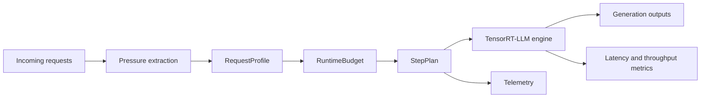
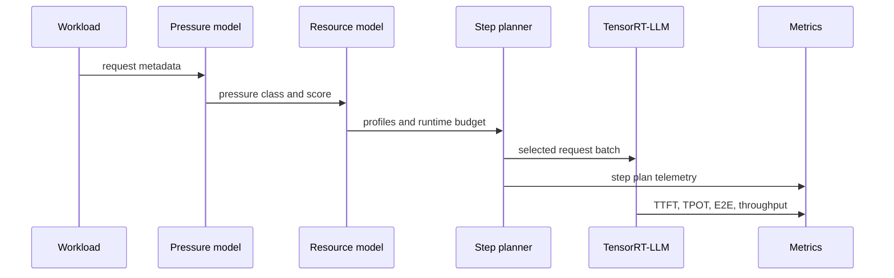

# TRT-LLM MoE Step Planner

[](https://github.com/NVIDIA/TensorRT-LLM)
[](#overview)
[](#design)
[](https://www.python.org/)

Pressure-aware step planning for TensorRT-LLM MoE inference.

## Overview

`TRT-LLM MoE Step Planner` is a runtime scheduling component for MoE inference workloads. It adds an explicit planning layer between request metadata and TensorRT-LLM execution so that step formation can account for MoE-specific pressure, not only token count and batch capacity.

The project focuses on one engineering problem:

> A batch can fit the runtime capacity model and still be a poor MoE execution step if multiple requests concentrate pressure on the same expert or rank.

The planner converts request metadata into a structured runtime model, builds a pressure-aware step plan, and executes that plan against the TensorRT engine path.

## Capabilities

- Converts request-level MoE pressure into a stable scheduling signal.
- Builds explicit `RequestProfile`, `RuntimeBudget`, and `StepPlan` objects.
- Applies pressure-aware step formation before TensorRT-LLM execution.
- Emits JSONL telemetry for scheduled and deferred requests.
- Provides reproducible baseline-versus-planned benchmark scripts.

## Architecture



The planner is deliberately small. It does not replace TensorRT-LLM kernels, modify model weights, or introduce a separate serving stack. Its only responsibility is to decide which requests should share the next execution step.

## Execution Pipeline



## Design

### Pressure Model

Implemented in [`scheduler/moe_pressure.py`](scheduler/moe_pressure.py).

The pressure model maps each request into one of three classes:

- `balanced`: no known hotspot pressure
- `hot_expert`: expert-level routing concentration
- `hot_rank`: rank-level concentration

Each class is assigned a scalar pressure score. The score is intentionally simple so it can be propagated through scheduler code without coupling the planner to a specific router implementation.

### Runtime Resource Model

Implemented in [`scheduler/resource_model.py`](scheduler/resource_model.py).

The resource model is the core interface of the project:

| Object | Role |
| --- | --- |
| `RequestProfile` | Normalized view of request state, token cost, pressure class, and pressure score. |
| `RuntimeBudget` | Per-step budget for batch size, token count, pressure, prefill quota, and generation quota. |
| `StepPlan` | Planner output: selected context requests, selected generation requests, deferred requests, total tokens, and total pressure. |

This design keeps policy logic out of raw request handling. Scheduler decisions operate on a defined contract instead of scattered request attributes.

### Step Planner

Implemented in [`scheduler/moe_microbatch_scheduler.py`](scheduler/moe_microbatch_scheduler.py) and quantitatively executed through [`scripts/run_patched.py`](scripts/run_patched.py).

The planner follows a decode-first policy:

1. Build a `RequestProfile` for each schedulable request.
2. Build a `RuntimeBudget` for the current step.
3. Prefer generation requests to protect decode latency.
4. Add a request only if batch size, token budget, and pressure budget remain valid.
5. Defer requests that would cause pressure over-commit.

The resulting behavior is a latency-first pressure isolation policy. It reduces the probability that multiple hot requests become stragglers in the same step.

## Why It Works

MoE inference step latency can be modeled as:

```text
L(B) = C(tokens(B)) + Q(pressure(B), skew(B))
```

where:

- `C(tokens(B))` is token-driven compute cost
- `Q(pressure(B), skew(B))` is contention cost from expert or rank concentration
- `B` is the set of requests in the step

For dense workloads, the second term is often small enough to ignore. For MoE workloads, it can dominate tail behavior when routing skew aligns across requests.

The planner relies on two practical assumptions:

1. Contention increases with aggregate pressure.
2. Near hotspot regimes, contention grows faster than linearly when hot requests are stacked.

Under those assumptions, splitting hot requests across steps can reduce p90 and p99 latency even if it lowers average batch size. The measured results show exactly this tradeoff: tail latency improves substantially, while throughput decreases when pressure isolation becomes aggressive.

## Implementation Map

| File | Responsibility | Reason for the change |
| --- | --- | --- |
| [`scheduler/moe_pressure.py`](scheduler/moe_pressure.py) | Pressure normalization | Makes MoE pressure a scheduler-visible signal. |
| [`scheduler/resource_model.py`](scheduler/resource_model.py) | Runtime contract | Separates scheduling assumptions from request parsing. |
| [`scheduler/moe_microbatch_scheduler.py`](scheduler/moe_microbatch_scheduler.py) | Step planning policy | Prevents hot requests from being blindly batched together. |
| [`scheduler/telemetry.py`](scheduler/telemetry.py) | JSONL telemetry | Makes step composition auditable. |
| [`scripts/run_baseline.py`](scripts/run_baseline.py) | Baseline runner | Captures default engine behavior. |
| [`scripts/run_patched.py`](scripts/run_patched.py) | Planned runner | Applies the planner to real engine execution. |
| [`scripts/summarize_results.py`](scripts/summarize_results.py) | Result aggregation | Produces comparable latency and throughput tables. |

## Evaluation

The measurements below were collected with:

- model: `Qwen/Qwen1.5-MoE-A2.7B-Chat`
- engine path: TensorRT-LLM `INT4 weight-only`
- GPU: `RTX 4060 Ti 16GB`

### Workloads

| Workload | Purpose |
| --- | --- |
| `Balanced MoE` | Non-regression control. |
| `Hot-Expert` | Expert hotspot stress case. |
| `Hot-Rank` | Rank hotspot stress case. |
| `Hot-Expert 24-request` | Larger validation run for the winning pressure case. |

### Results

| Workload | Metric | Baseline | Planned | Delta |
| --- | --- | ---: | ---: | ---: |
| Balanced | TTFT p90 | `0.0816s` | `0.0739s` | `-0.0077s` |
| Balanced | E2E p90 | `1.4878s` | `1.4748s` | `-0.0129s` |
| Balanced | Throughput | `278.55 tok/s` | `281.47 tok/s` | `+2.92 tok/s` |
| Hot-Expert | TTFT p90 | `0.0748s` | `0.0112s` | `-0.0635s` |
| Hot-Expert | E2E p90 | `1.8668s` | `1.5741s` | `-0.2927s` |
| Hot-Expert | TPOT p90 | `0.0116s` | `0.0098s` | `-0.0017s` |
| Hot-Rank | TTFT p90 | `0.0737s` | `0.0131s` | `-0.0606s` |
| Hot-Rank | E2E p90 | `1.9942s` | `1.7115s` | `-0.2827s` |
| Hot-Expert 24-request | TTFT p90 | `0.0733s` | `0.0111s` | `-0.0622s` |
| Hot-Expert 24-request | E2E p90 | `1.8348s` | `1.5983s` | `-0.2365s` |
| Hot-Expert 24-request | Throughput | `310.44 tok/s` | `99.81 tok/s` | `-210.63 tok/s` |

## Interpretation

The results support three engineering conclusions:

1. The planner does not regress the balanced control.
2. Pressure-aware step formation materially reduces tail latency on hotspot workloads.
3. The current policy is latency-first; it trades throughput for pressure isolation.

This repository is therefore best viewed as a compact pressure-isolation planner. It demonstrates that MoE pressure is useful as a scheduling signal and exposes the next engineering problem: recovering throughput while preserving tail-latency gains.

## Limitations

The quantitative path uses the real TensorRT engine backend with planner-driven batch composition. The project contains TensorRT-LLM scheduler-aligned code, but the final measured comparison is not a pure in-backend PyTorch scheduler benchmark.

The pressure classes are also intentionally coarse. They are suitable for validating the scheduling mechanism, but production deployment would need live router telemetry or a model-specific pressure estimator.

## Repository Layout

- [`scheduler/`](scheduler): pressure model, runtime model, planner, telemetry
- [`scripts/`](scripts): workload generation, execution drivers, summary tools
- [`workloads/`](workloads): fixed MoE workloads
- [`results/`](results): raw outputs and comparison tables
- [`docs/`](docs): implementation notes and detailed reports

## Reproducibility

```bash
python scripts/generate_workloads.py
python scripts/run_baseline.py ...
python scripts/run_patched.py ...
python scripts/summarize_results.py ...
```

Additional detail:

- [`docs/final_report.md`](docs/final_report.md)
- [`docs/result_summary.md`](docs/result_summary.md)
- [`results/compare_tables/summary.md`](results/compare_tables/summary.md)
